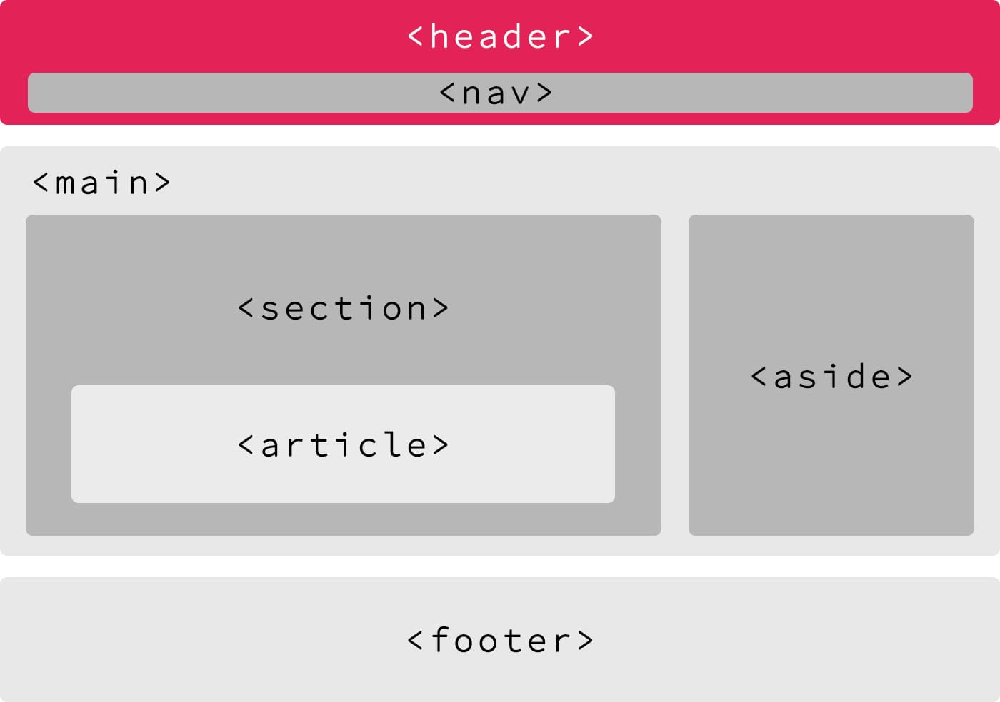

# HTML - elements of a web page 
    Create the foundation of any HTML page.

HTML is about content. CSS is about the look and feel.

## Doctype
The <doctype> is necessary at the top of every HTML page to force the browser to render the page according to relevant specifications.
`<!-- Doctype HTML5 -->
    <!DOCTYPE html>
    <!-- Lowercase is also valid -->
    <!doctype html>`
## Resources
- [Doctype - MDN Web Docs Glossary: Definitions of Web-related terms | MDN](https://developer.mozilla.org/en-US/docs/Glossary/Doctype)

- [HEAD - A free guide to head elements](https://htmlhead.dev/)


## HTML TAG 
The <html> HTML tag tells the browser that the document is an HTML webpage. It is used as a container for all the HTML elements.

Warning!

The doctype is the only element living outside the html tag.
`<html lang="fr" dir="ltr">`

## Language and reading direction
- [Building RTL-Aware Web Apps & Websites: Part 1 - Mozilla Hacks - the Web developer blog](https://hacks.mozilla.org/2015/09/building-rtl-aware-web-apps-and-websites-part-1/?ref=frontendchecklist)


## Head Tag  

The `<head>` element contains all the metadata related to your page. All the elements placed inside the `<head>` are not visible in the browser window.  

Many types of metadata exist, some of which are specific to certain CMS platforms.  

### Usage  

You can find the following inside the `<head>`:  

- **Title of the webpage**  
- **Asynchronous script calls**  
- **Metadata**  
- **Embedded CSS code** (critical CSS)  
- **Embedded JavaScript code**  

## Resources  

[HEAD – A free guide to head elements](https://htmlhead.dev/)  

## Meta Charset  

The `<meta charset>` tag declares the page’s character encoding.  

### Example Usage  

    ```html
    <head>
        <!-- Set character encoding for the document -->
        <meta charset="utf-8">
    </head>

## Resources
- [Meta: The Document-level Metadata Element - HTML: Hypertext Markup Language | MDN](https://developer.mozilla.org/en-US/docs/Web/HTML/Element/meta#attr-charset)  
- [Declaring Character Encodings in HTML - W3C](https://www.w3.org/International/questions/qa-html-encoding-declarations)  
- [Meta Charset - Bitsofco.de](https://bitsofco.de/meta-charset/)  


## Viewport

The meta viewport gives information about the initial size of the viewport.

Tip: The viewport is used by mobile devices only.

Accessibility tip: Never use maximum-scale=1.0. [It prevents the user from zooming in on the website](https://www.a11yproject.com/posts/never-use-maximum-scale/). It causes an accessibility issue.
    ```html
    
    <head>
        ...
        <!-- Viewport for responsive web design -->
        <meta name="viewport" content="key=value, key=value">
    </head>

### Resources
- [Responsive Design With Viewport Control](https://bitsofco.de/responsive-design-viewport/)

## Title 

- The title meta tag defines the title of the web page.

- Tip: The title is only visible on the tab/window of your browser.

Warning! The title should always have less than 56 characters.

    ```html
    <head>
        ...
        <!-- Document Title -->
        <title>Page title</title>
    </head>

### Resources 

[The ideal width of the SEO title • Yoast](https://yoast.com/page-titles-seo/)

## Meta description

    ``` html 
    <head>
        ...
        <!-- Meta Description -->
        <meta name="description" content="Description of the page less than 150 characters">
    </head>

### Resources

[How to create the right meta description](https://yoast.com/meta-descriptions/)

## Favicons
    ```html 
    <head>
        ...
        <!-- Standard favicon -->
        <link rel="icon" type="image/x-icon" href="https://example.com/favicon.ico">
        <!-- Recommended favicon format -->
        <link rel="icon" type="image/png" href="https://example.com/favicon.png">
        ...
    </head>

### Resources

- [Favicon & App Icon Generator](https://www.favicon-generator.org/)
- [Favicon Generator for all platforms: iOS, Android, PC/Mac…](https://realfavicongenerator.net/)
- [Obsessive cheat sheet to favicon sizes/types.](https://github.com/audreyfeldroy/favicon-cheat-sheet)
- [Favicons, Touch Icons, Tile Icons, etc. Which Do You Need? | CSS-Tricks](https://css-tricks.com/favicon-quiz/)
- [PNG favicons - caniuse](https://caniuse.com/link-icon-png)

## Tag attributes

Attributes provide additional information or instruction for an HTML element. It is always included inside the opening tag.

### Data-attribute

It is possible to declare any attribute using the data- prefix
    ``` html 
    <tag data-extra-attr="value">some content</tag>

### Resources 

[HTML attribute reference - HTML: Hypertext Markup Language | MDN](https://developer.mozilla.org/en-US/docs/Web/HTML/Attributes)

### header Tag 
- The <header> HTML tag element is used to identify the top of a webpage, article, section, or other segment of a page. The header is normally always the same across all pages of your website.
    
